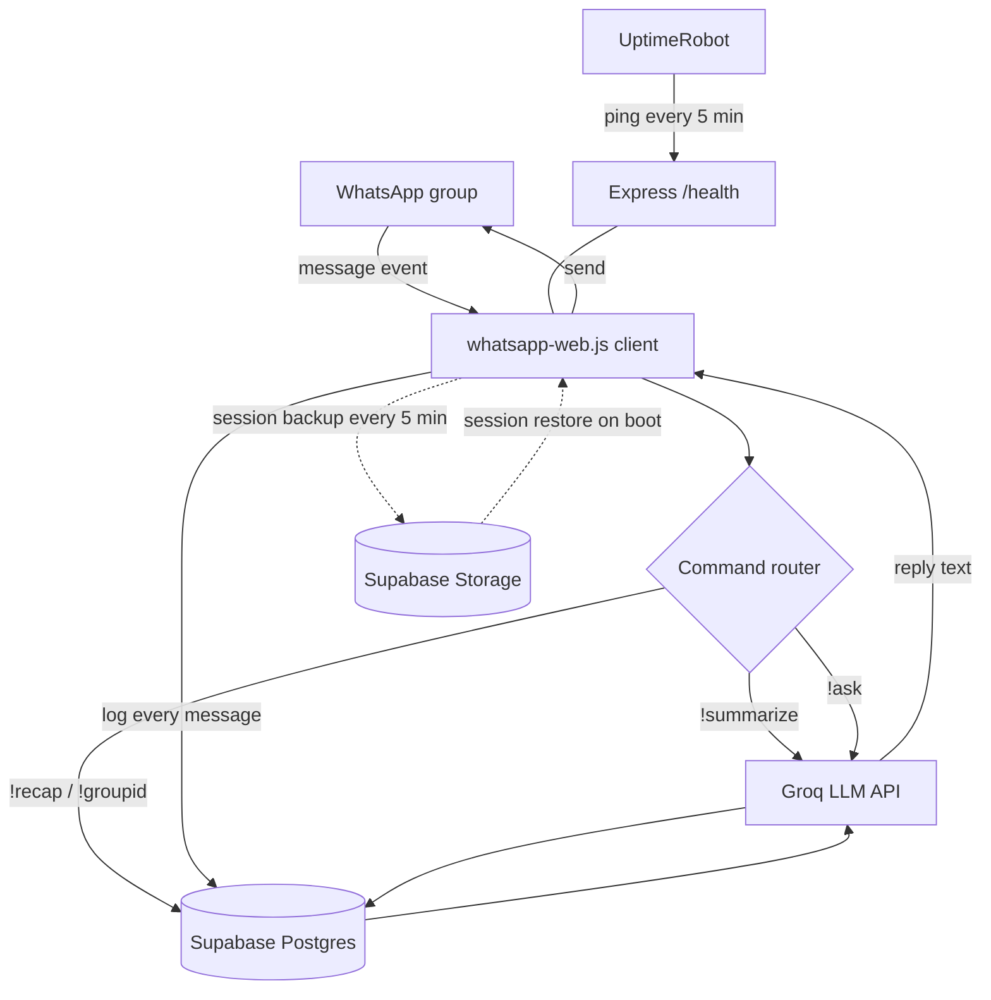

# WhatsApp Group AI Agent — v1 Implementation Spec

Target: single WhatsApp group, three working commands, always-on hosting, zero
recurring cost, period — no paid tier anywhere in the stack. This document is
the full build spec — follow it file by file.

## Assumptions locked in for v1 (change these and the whole spec shifts)

- **One group only.** No multi-tenant logic. Group ID lives in an env var.
- **Groq (Llama 3.3 70B) for the LLM calls, not Claude.** Confirmed current as
  of this write-up: no credit card anywhere on the platform, no expiration,
  rate-limited rather than billed. Claude API only offers a one-time trial
  credit — it isn't free once that runs out, so it's not a fit while budget is
  genuinely zero. The `ask()` function signature is provider-agnostic on
  purpose: swapping to Claude later, once there's revenue to justify the
  quality bump, is a one-file change (`src/llm/client.js`), not a rewrite.
- **No vector search / RAG.** Neither Groq nor Claude offer embeddings — real
  RAG needs a dedicated provider (Voyage AI) regardless of chat model. Not
  worth it yet. Context = last N messages, read straight from Postgres. This
  is intentionally simple, not a shortcut we regret — it's the correct amount
  of engineering for a scoping demo.
- **whatsapp-web.js**, not Baileys. Slower/heavier but far less boilerplate.
  Migrate to Baileys only when serving multiple client groups matters for RAM cost.
- **Render (free tier)** for hosting, kept alive by **UptimeRobot** pinging `/health`.
- **Supabase** does two jobs: Postgres table for chat history, Storage bucket
  for WhatsApp session persistence (so restarts don't require re-scanning a QR code).

## Architecture



## Prerequisites (accounts, done before coding starts)

1. Groq Cloud account (console.groq.com) → API key generated. No credit card
   anywhere in this signup flow.
2. Supabase project created → grab `Project URL` and `service_role` key
   (Settings → API). **Service role key only — never the anon key — since this
   runs server-side and needs Storage write access.**
3. A dedicated WhatsApp number for the bot (not your personal daily driver —
   this is the account whatsapp-web.js will control).
4. Render account, connected to the GitHub repo this code will live in.
5. UptimeRobot account (free).

## Supabase setup (manual dashboard steps — do this before running any code)

**1. Create the table.** SQL editor → run:

```sql
create table if not exists messages (
  id bigint generated always as identity primary key,
  group_id text not null,
  author text not null,
  author_name text,
  body text not null,
  created_at timestamptz not null default now()
);

create index if not exists idx_messages_group_created
  on messages (group_id, created_at desc);
```

No `pgvector` extension needed for v1 — see Phase 2 backlog for when that changes.

**2. Create the storage bucket.** Storage → New bucket → name `wa-sessions` →
**Private**. This holds the zipped WhatsApp session so the bot doesn't need a
fresh QR scan every time Render restarts it.

## File structure

```
wa-agent/
├── .env.example
├── .gitignore
├── package.json
├── index.js
├── sql/
│   └── schema.sql
└── src/
    ├── config.js
    ├── whatsapp/
    │   ├── client.js
    │   └── supabaseStore.js
    ├── llm/
    │   └── client.js
    ├── db/
    │   └── messages.js
    ├── commands/
    │   ├── index.js
    │   ├── summarize.js
    │   ├── ask.js
    │   ├── recap.js
    │   ├── help.js
    │   └── groupid.js
    ├── server/
    │   └── app.js
    └── utils/
        └── delay.js
```

## Build order (dependency-first, so nothing references a module that doesn't exist yet)

1. Scaffold repo, `npm install` deps below.
2. `src/config.js`
3. `src/whatsapp/supabaseStore.js`
4. `src/llm/client.js`
5. `src/db/messages.js`
6. `src/commands/*` (all five files, then `index.js` router)
7. `src/utils/delay.js`
8. `src/whatsapp/client.js`
9. `src/server/app.js`
10. `index.js` (entry point, wires everything)
11. Local test end-to-end (see Acceptance Checklist)
12. Deploy to Render
13. Configure UptimeRobot

## Dependencies

```bash
npm init -y
npm install whatsapp-web.js qrcode express @supabase/supabase-js openai dotenv
npm install -D nodemon
```

Add to `package.json`:

```json
{
  "engines": { "node": ">=18.0.0" },
  "scripts": {
    "start": "node index.js",
    "dev": "nodemon index.js"
  }
}
```

## `.env.example`

```
GROQ_API_KEY=
SUPABASE_URL=
SUPABASE_SERVICE_ROLE_KEY=
TARGET_GROUP_ID=
QR_SECRET=change-me
PORT=3000
```

`TARGET_GROUP_ID` stays blank on first deploy — the `!groupid` command
(works in any chat, no auth needed) returns it so you don't have to dig
through Render logs. Copy that value back into the env var and redeploy.

`QR_SECRET` protects the `/qr` page from being viewed by anyone who guesses
the Render URL — see server/app.js below.

## `.gitignore`

```
node_modules/
.env
*.zip
.wwebjs_auth/
.wwebjs_cache/
```

## `src/config.js`

```javascript
require('dotenv').config();

const required = ['GROQ_API_KEY', 'SUPABASE_URL', 'SUPABASE_SERVICE_ROLE_KEY'];
for (const key of required) {
  if (!process.env[key]) {
    console.error(`Missing required env var: ${key}`);
    process.exit(1);
  }
}

module.exports = {
  groqApiKey: process.env.GROQ_API_KEY,
  supabaseUrl: process.env.SUPABASE_URL,
  supabaseServiceKey: process.env.SUPABASE_SERVICE_ROLE_KEY,
  targetGroupId: process.env.TARGET_GROUP_ID || null,
  qrSecret: process.env.QR_SECRET || 'change-me',
  port: process.env.PORT || 3000
};
```

## `src/whatsapp/supabaseStore.js`

> **Antigravity: verify this against the installed version before finalizing.**
> The RemoteAuth store contract (`sessionExists` / `save` / `extract` / `delete`)
> is stable across recent whatsapp-web.js versions, but check
> `node_modules/whatsapp-web.js/src/authStrategies/RemoteAuth.js` (or its type
> defs) to confirm exact parameter shapes for the installed version before
> treating this as final — don't blindly trust a remembered snippet here.

```javascript
const fs = require('fs');
const { createClient } = require('@supabase/supabase-js');
const config = require('../config');

const supabase = createClient(config.supabaseUrl, config.supabaseServiceKey);
const BUCKET = 'wa-sessions';

class SupabaseStore {
  async sessionExists({ session }) {
    const { data, error } = await supabase.storage.from(BUCKET).list();
    if (error) throw error;
    return data?.some((f) => f.name === `${session}.zip`) ?? false;
  }

  async save({ session }) {
    const filePath = `${session}.zip`;
    const fileBuffer = fs.readFileSync(filePath);
    const { error } = await supabase.storage
      .from(BUCKET)
      .upload(`${session}.zip`, fileBuffer, { upsert: true });
    if (error) throw error;
  }

  async extract({ session, path }) {
    const { data, error } = await supabase.storage.from(BUCKET).download(`${session}.zip`);
    if (error) throw error;
    const buffer = Buffer.from(await data.arrayBuffer());
    fs.writeFileSync(path, buffer);
  }

  async delete({ session }) {
    const { error } = await supabase.storage.from(BUCKET).remove([`${session}.zip`]);
    if (error) throw error;
  }
}

module.exports = { supabase, SupabaseStore };
```

## `src/llm/client.js`

Groq, not Claude — genuinely free tier, no card, no expiration, just rate
limits. Confirmed current numbers for `llama-3.3-70b-versatile`: 30 requests/
min, 12,000 tokens/min, 1,000 requests/day, 100,000 tokens/day, enforced at
the organization level. That's comfortably enough for one test group.

Groq's API is OpenAI-compatible, so this uses the `openai` SDK pointed at
Groq's base URL instead of a Groq-specific SDK — one less thing to learn.

```javascript
const OpenAI = require('openai');
const config = require('../config');

const client = new OpenAI({
  apiKey: config.groqApiKey,
  baseURL: 'https://api.groq.com/openai/v1'
});

const MODEL = 'llama-3.3-70b-versatile';

async function ask(systemPrompt, userPrompt, maxTokens = 500) {
  const res = await client.chat.completions.create({
    model: MODEL,
    max_tokens: maxTokens,
    messages: [
      { role: 'system', content: systemPrompt },
      { role: 'user', content: userPrompt }
    ]
  });
  return res.choices[0]?.message?.content ?? '';
}

module.exports = { ask };
```

**Fallback option:** if you ever hit Groq's per-minute cap during a burst of
testing, Gemini Flash (Google AI Studio) is the other genuinely-free option —
same one you and Gemini/Groq combo used in Second Brain, so the integration
pattern will feel familiar. One real gotcha to know about first: if you ever
enable billing on that Google Cloud project for *anything else*, Gemini's
free tier disappears entirely for the whole project, not just the new
feature. Groq has no equivalent trap — there's no "enable billing" switch to
accidentally flip — which is why it's the default here, not just a coin flip.

## `src/db/messages.js`

```javascript
const { supabase } = require('../whatsapp/supabaseStore');

async function insertMessage({ groupId, author, authorName, body }) {
  const { error } = await supabase.from('messages').insert({
    group_id: groupId,
    author,
    author_name: authorName || null,
    body
  });
  if (error) console.error('insertMessage error:', error.message);
}

async function getRecentMessages(groupId, limit = 50) {
  const { data, error } = await supabase
    .from('messages')
    .select('*')
    .eq('group_id', groupId)
    .order('created_at', { ascending: false })
    .limit(limit);
  if (error) {
    console.error('getRecentMessages error:', error.message);
    return [];
  }
  return data.reverse(); // chronological order for prompt context
}

module.exports = { insertMessage, getRecentMessages };
```

## `src/commands/summarize.js`

```javascript
const { getRecentMessages } = require('../db/messages');
const { ask } = require('../llm/client');

module.exports = async function summarize(groupId, args) {
  const n = parseInt(args[0], 10) || 50;
  const messages = await getRecentMessages(groupId, n);
  if (messages.length === 0) return 'No messages logged yet — I need some chat history first.';

  const transcript = messages
    .map((m) => `${m.author_name || m.author}: ${m.body}`)
    .join('\n');

  return ask(
    'You summarize WhatsApp group chats. Be concise. Use bullet points for distinct topics.',
    `Summarize this conversation:\n\n${transcript}`
  );
};
```

## `src/commands/ask.js`

```javascript
const { getRecentMessages } = require('../db/messages');
const { ask } = require('../llm/client');

module.exports = async function askCommand(groupId, args) {
  const question = args.join(' ').trim();
  if (!question) return 'Usage: !ask <your question>';

  const messages = await getRecentMessages(groupId, 40);
  const context = messages
    .map((m) => `${m.author_name || m.author}: ${m.body}`)
    .join('\n');

  return ask(
    'You answer questions about a WhatsApp group chat using only the provided context. If the answer is not in the context, say so.',
    `Chat context:\n${context}\n\nQuestion: ${question}`
  );
};
```

## `src/commands/recap.js`

```javascript
const { getRecentMessages } = require('../db/messages');

module.exports = async function recap(groupId) {
  const messages = await getRecentMessages(groupId, 50);
  if (messages.length === 0) return 'No recent activity logged yet.';
  const speakers = [...new Set(messages.map((m) => m.author_name || m.author))];
  return `Active in the last ${messages.length} messages:\n${speakers.join('\n')}`;
};
```

## `src/commands/help.js`

```javascript
module.exports = async function help() {
  return [
    'Available commands:',
    '!summarize [n] — summarize the last n messages (default 50)',
    '!ask <question> — ask something about recent chat',
    '!recap — list who has been active recently',
    "!groupid — show this chat's WhatsApp ID (setup only)",
    '!help — show this message'
  ].join('\n');
};
```

## `src/commands/groupid.js`

```javascript
module.exports = async function groupid(_groupId, _args, chat) {
  return `Chat ID: ${chat.id._serialized}`;
};
```

## `src/commands/index.js`

```javascript
const summarize = require('./summarize');
const ask = require('./ask');
const recap = require('./recap');
const help = require('./help');
const groupid = require('./groupid');

const registry = { summarize, ask, recap, help, groupid };

function parseCommand(body) {
  if (!body.startsWith('!')) return null;
  const [raw, ...args] = body.slice(1).trim().split(/\s+/);
  return { name: raw.toLowerCase(), args };
}

async function dispatch(body, groupId, chat) {
  const parsed = parseCommand(body);
  if (!parsed) return null;
  const handler = registry[parsed.name];
  if (!handler) return null;
  return handler(groupId, parsed.args, chat);
}

module.exports = { dispatch };
```

## `src/utils/delay.js`

Small human-like pause before replying — makes the bot look less like a
script hammering the API, which matters for WhatsApp ban risk.

```javascript
function humanDelay(minMs = 800, maxMs = 2200) {
  const ms = Math.floor(Math.random() * (maxMs - minMs)) + minMs;
  return new Promise((resolve) => setTimeout(resolve, ms));
}

module.exports = { humanDelay };
```

## `src/whatsapp/client.js`

```javascript
const { Client, RemoteAuth } = require('whatsapp-web.js');
const { SupabaseStore } = require('./supabaseStore');
const { insertMessage } = require('../db/messages');
const { dispatch } = require('../commands');
const config = require('../config');
const { humanDelay } = require('../utils/delay');

let latestQr = null;
let ready = false;

const client = new Client({
  authStrategy: new RemoteAuth({
    store: new SupabaseStore(),
    backupSyncIntervalMs: 300000 // 5 min — must stay above the library's enforced minimum
  }),
  puppeteer: {
    headless: true,
    args: [
      '--no-sandbox',
      '--disable-setuid-sandbox',
      '--disable-dev-shm-usage',
      '--no-first-run',
      '--disable-gpu'
    ]
  }
});

client.on('qr', (qr) => {
  latestQr = qr;
  console.log('QR ready — visit /qr to scan');
});

client.on('ready', () => {
  latestQr = null;
  ready = true;
  console.log('WhatsApp client ready');
});

client.on('disconnected', (reason) => {
  ready = false;
  console.error('WhatsApp client disconnected:', reason);
});

client.on('message', async (msg) => {
  if (msg.fromMe) return;

  const chat = await msg.getChat();

  // Works in any chat, unauthenticated by design — this is how you discover
  // TARGET_GROUP_ID without digging through Render logs.
  if (msg.body.trim().toLowerCase() === '!groupid') {
    await msg.reply(`Chat ID: ${chat.id._serialized}`);
    return;
  }

  if (!chat.isGroup) return;
  if (!config.targetGroupId || chat.id._serialized !== config.targetGroupId) return;

  const contact = await msg.getContact();

  await insertMessage({
    groupId: chat.id._serialized,
    author: msg.author || msg.from,
    authorName: contact.pushname || contact.number,
    body: msg.body
  });

  const reply = await dispatch(msg.body, chat.id._serialized, chat);
  if (reply) {
    await humanDelay();
    await msg.reply(reply);
  }
});

module.exports = {
  client,
  getQr: () => latestQr,
  isReady: () => ready
};
```

## `src/server/app.js`

```javascript
const express = require('express');
const QRCode = require('qrcode');
const config = require('../config');
const { getQr, isReady } = require('../whatsapp/client');

const app = express();

app.get('/health', (_req, res) => {
  res.json({ status: 'alive', whatsappReady: isReady(), uptime: process.uptime() });
});

app.get('/qr', async (req, res) => {
  if (req.query.key !== config.qrSecret) return res.status(403).send('Forbidden');

  const qr = getQr();
  if (!qr) return res.send('Already authenticated — no QR needed.');

  const img = await QRCode.toDataURL(qr);
  res.send(`<html><body style="display:flex;align-items:center;justify-content:center;height:100vh;margin:0;font-family:sans-serif">
    <div style="text-align:center"><h2>Scan with WhatsApp</h2></div>
  </body></html>`);
});

module.exports = app;
```

## `index.js`

```javascript
const config = require('./src/config');
const app = require('./src/server/app');
const { client } = require('./src/whatsapp/client');

app.listen(config.port, () => console.log(`Server listening on port ${config.port}`));

client.initialize();

process.on('SIGTERM', async () => {
  console.log('SIGTERM received — shutting down gracefully');
  await client.destroy();
  process.exit(0);
});
```

## Deployment — Render

1. Push repo to GitHub (confirm `.env` is actually excluded — check the commit diff).
2. Render dashboard → New → Web Service → connect the repo.
3. Build command: `npm install`. Start command: `npm start`. Instance: Free.
4. Environment tab → add all vars from `.env.example` except `TARGET_GROUP_ID`
   (leave blank initially).
5. Deploy → watch logs for `QR ready — visit /qr`.
6. Visit `https://<your-app>.onrender.com/qr?key=<your QR_SECRET>` → scan
   with the bot's WhatsApp number (Settings → Linked Devices → Link a Device).
7. Send `!groupid` inside your test group → copy the returned ID into
   `TARGET_GROUP_ID` on Render → redeploy.

**Known constraint:** Render free tier gives 512MB RAM. Chromium (via
Puppeteer) typically uses 250–350MB. It fits, but if you see OOM crashes in
logs, that's the free-tier ceiling talking — the fix at that point is
migrating to Baileys, not tuning flags further.

## Keep-alive — UptimeRobot

1. uptimerobot.com → free account.
2. Add New Monitor → HTTP(s).
3. URL: `https://<your-app>.onrender.com/health`.
4. Interval: 5 minutes.
5. Save. Render now never spins down from inactivity.

## Acceptance checklist — v1 is done when

- [ ] `npm install` completes clean, no peer dependency errors.
- [ ] Locally, `/qr?key=...` renders a scannable QR and linking succeeds.
- [ ] `!groupid` sent in the test group returns its correct chat ID.
- [ ] With `TARGET_GROUP_ID` set, `!summarize` returns a coherent summary.
- [ ] `!ask <question>` returns an answer grounded in recent messages (and
      correctly says it doesn't know when the answer isn't in context).
- [ ] `!recap` lists distinct recent senders.
- [ ] Killing and restarting the local process does **not** require re-scanning
      the QR (session pulled back from Supabase Storage).
- [ ] Deployed on Render, `/health` returns `200` with `whatsappReady: true`.
- [ ] UptimeRobot monitor shows green for 30+ minutes straight.
- [ ] Laptop closed for 30+ minutes, bot still responds in the group — this is
      the actual point of the whole exercise.

## Explicitly out of scope for v1 (Phase 2 backlog)

- **Vector search / RAG** — needs a dedicated embeddings provider (Voyage AI),
  since neither Groq nor Claude offer embeddings. Add once a specific use case
  needs semantic search over chat history longer than a recency window covers.
- **Multi-group support** — requires a `groups` table and routing logic instead
  of a single env var.
- **n8n orchestration layer** — worth adding once command logic outgrows a
  simple router, or once this needs to fan out to external services (Sheets,
  Slack, CRM).
- **Scheduled daily digest** — cron-triggered `!summarize` without a user
  typing the command.
- **Admin/moderation commands** — mute, warn, kick-style actions gated to group admins.
- **Usage analytics** — a `command_logs` table, useful once you're pitching
  this as a service and need numbers to show.
- **Baileys migration** — once RAM economics matter (i.e. serving real clients,
  not a demo).

## Cost reality check

Every piece of this stack is free with no card on file anywhere — not a trial,
not a credit balance that runs out:

| Component | Free tier | Card required? |
|---|---|---|
| Groq (LLM calls) | 30 RPM / 12K TPM / 1K RPD / 100K TPD, no expiration | No |
| Supabase | 500MB DB, 1GB storage | No |
| Render | Web service, spins down when idle (solved by UptimeRobot) | No |
| UptimeRobot | 50 monitors | No |
| whatsapp-web.js | Open source | N/A |

Total monthly cost at this scale: **$0**, indefinitely, not just during a trial window.

**When you're ready to spend money on this** — post-traction, not before —
Claude is the natural upgrade for `!ask`/`!summarize` quality, since the rest
of the codebase calls `ask()` and has no idea which provider sits behind it.
Swapping later means rewriting one file, not the app.
